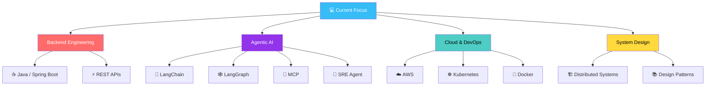
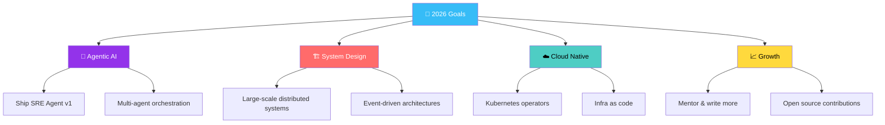

<!-- ============ TITLE BANNER ============ -->


<!-- ============ SYSTEM ARCHITECTURE BANNER (animated, illustrative) ============ -->
<!-- File lives in this repo at ./assets/system-architecture-banner.svg — see setup note below -->
<div align="center">


</div>

<!-- ============ ANIMATED TYPING SUBTITLE ============ -->
<div align="center">

[](https://git.io/typing-svg)

<!-- ============ TOP BADGES ============ -->

<a href="https://github.com/anuragpatel23?tab=followers"></a>
<a href="https://github.com/anuragpatel23?tab=repositories"></a>

<br><br>

<!-- Status badges — edit these to match your real availability -->


</div>

<!-- ============ TECH STACK WALL BANNER ============ -->
<div align="center">


</div>

---

<div align="center">

### 🧭 Quick Navigation

[📊 Stats](#-github-stats) · [👋 About](#-about-me) · [🛠️ Tech Stack](#️-tech-stack) · [🚀 Projects](#-featured-projects) · [🧩 Building](#-what-im-building) · [🌟 Skills](#-skills-and-interests) · [🐍 Snake](#-contribution-snake) · [🧊 3D Calendar](#-3d-contribution-calendar) · [🗺️ Roadmap](#️-2026-roadmap) · [🤝 Connect](#-lets-connect)

</div>

---

<div align="center">

</div>

## 📊 GitHub Stats

<div align="center">


<br>


<br>


</div>

---

<div align="center">

</div>

## 👋 About Me

```typescript
const anurag: Engineer = {
  name:     "Anurag Patel",
  role:     "Backend Engineer & Systems Thinker",
  location: "🌍 Earth  ·  Open to Remote",

  focus: [
    "🤖 Building an agentic SRE assistant — RAG, LangChain, LangGraph, MCP",
    "🏗️  System design & distributed backend architecture",
    "☁️  Cloud-native infra on AWS & Kubernetes",
    "📐 Clean, well-tested backend services",
  ],

  stack: {
    languages: ["Java", "Python", "JavaScript"],
    backend:   ["Spring Boot", "REST APIs"],
    database:  ["PostgreSQL", "Oracle"],
    ai_ml:     ["LangChain", "LangGraph", "OpenAI", "RAG", "MCP"],
    devOps:    ["Docker", "Kubernetes", "AWS", "Git", "Linux"],
  },

  learning:  ["Agentic AI architectures", "LangGraph orchestration", "MCP servers"],
  principle: "Ship it, scale it, and don't get paged for it.",
};
```

- 🔭 Currently working on **SRE Agent**
- 🌱 Currently learning **agentic AI** — RAG, LangChain, LangGraph & MCP
- 💬 Ask me about **Backend and System Design**
- ⚡ Fun fact: my code works on the first try... in my dreams 😴

---

<div align="center">

</div>

## 🛠️ Tech Stack

<div align="center">

<a href="https://skillicons.dev">
  
</a>

<br><br>

**Languages & Frameworks**


**Data & Caching**


**Cloud, DevOps & Observability**


**Agentic AI & Automation**


**AI Coding Assistants**


</div>

---

<div align="center">

</div>

## 🚀 Featured Projects

<!-- ─────────────────────────────────────────────────────────────────
     HOW TO ADD A PROJECT:
     Copy a row, fill in Project / Description / Tech badge / Link.
     Keep one row per project.
───────────────────────────────────────────────────────────────── -->

### 🤖 Currently Building

| Project | Description | Status |
|---|---|---|
| 🤖 **SRE Agent** | Agentic AI assistant for site-reliability workflows, built on LangChain / LangGraph with MCP tool access. | 🚧 Active |

### 📚 Reference & Learning Repos

| Repo | Focus | Link |
|---|---|---|
| 🏗️ **system-design-masterclass** | System design concepts, patterns & case studies. | [Repo](https://github.com/anuragpatel23/system-design-masterclass) |
| 🤖 **agentic-ai-masterclass** | RAG, LangChain, LangGraph & MCP notes and experiments. | [Repo](https://github.com/anuragpatel23/agentic-ai-masterclass) |
| 🧮 **dsa-masterclass** | Data structures & algorithms practice. | [Repo](https://github.com/anuragpatel23/dsa-masterclass) |
| 📐 **design-pattern-masterclass** | Classic OOP design patterns, implemented. | [Repo](https://github.com/anuragpatel23/design-pattern-masterclass) |
| 🌐 **fullstack-masterclass** | End-to-end fullstack build-alongs. | [Repo](https://github.com/anuragpatel23/fullstack-masterclass) |
| 🎯 **blind75** | Blind 75 interview problem solutions. | [Repo](https://github.com/anuragpatel23/blind75) |

<div align="center">

<a href="https://github.com/anuragpatel23/system-design-masterclass">
  
</a>
<a href="https://github.com/anuragpatel23/agentic-ai-masterclass">
  
</a>
<br/>
<a href="https://github.com/anuragpatel23/dsa-masterclass">
  
</a>
<a href="https://github.com/anuragpatel23/design-pattern-masterclass">
  
</a>
<br/>
<a href="https://github.com/anuragpatel23/fullstack-masterclass">
  
</a>
<a href="https://github.com/anuragpatel23/blind75">
  
</a>

</div>

---

## 🧩 What I'm Building



<details>
<summary><b>📖 Resources I'm currently going through</b></summary>
<br>

> A short reference list for the agentic-AI learning path mentioned above — not original work, kept here for my own use.

| Resource | What it's for | Link |
|---|---|---|
| LangChain Docs | Core framework for building LLM-powered apps. | [Visit](https://python.langchain.com/) |
| LangGraph Docs | Stateful, graph-based agent orchestration. | [Visit](https://langchain-ai.github.io/langgraph/) |
| Model Context Protocol | Standard for connecting agents to tools & data. | [Visit](https://modelcontextprotocol.io/) |

</details>

---

<div align="center">

## 🌟 Skills and Interests

</div>

<!-- Sample content below — swap in your real interests/focus areas -->
<table>
  <tr>
    <td width="33%" valign="top">
      <h3>🎯 Currently Focused On</h3>
      - 🔭 Building the <strong>SRE Agent</strong><br>
      - 🌱 Deepening <strong>agentic AI</strong> (RAG, LangGraph, MCP)<br>
      - 🏗️ Practicing <strong>large-scale system design</strong><br>
      - ☁️ Getting hands-on with <strong>Kubernetes</strong><br>
      - 🤝 Open to <strong>collaboration</strong>
    </td>
    <td width="33%" valign="top">
      <h3>🎨 Beyond Tech</h3>
      - 📖 Reading engineering blogs & postmortems<br>
      - 🎮 Gaming<br>
      - ⚽ Following football<br>
      - 🎧 Music while coding
    </td>
    <td width="33%" valign="top">
      <h3>🎓 Always Learning</h3>
      - 📚 Reading technical books<br>
      - 🎯 Taking online courses<br>
      - 🏗️ Building side projects<br>
      - 📝 Writing notes / blog drafts<br>
      - 🌱 Growing every day
    </td>
  </tr>
</table>

---

## 🐍 Contribution Snake

<!-- Generated by .github/workflows/snake.yml → pushed to the "output" branch -->
<div align="center">


</div>

---

## 🧊 3D Contribution Calendar

<!-- Generated daily by .github/workflows/profile-3d.yml → committed back to main -->
<div align="center">


</div>

---

## 😂 Fun Extras

<div align="center">

<!-- NEW: Readme-Jokes — refreshes on every page load -->


<br><br>

<!-- Dev quote of the day -->


</div>

---

## 📅 Coding Streak & Metrics

<div align="center">

<!-- Commits per day of week (uses the same vercel app as the stats above — very reliable) -->


</div>

---

## ⭐ Star History

<div align="center">

[](https://star-history.com/#anuragpatel23/system-design-masterclass&anuragpatel23/agentic-ai-masterclass&anuragpatel23/dsa-masterclass&Date)

</div>

---

<div align="center">

</div>

## 🗺️ 2026 Roadmap



---

<div align="center">

### 🌟 *"Good backends are boring in production and interesting in design."*

<br>

## 🤝 Let's Connect

<a href="https://linkedin.com/in/anurag-patel" target="_blank"></a>
<a href="https://github.com/anuragpatel23" target="_blank"></a>

<br><br>


**⭐️ From [anuragpatel23](https://github.com/anuragpatel23) — Made with 💜 in Markdown**

</div>
