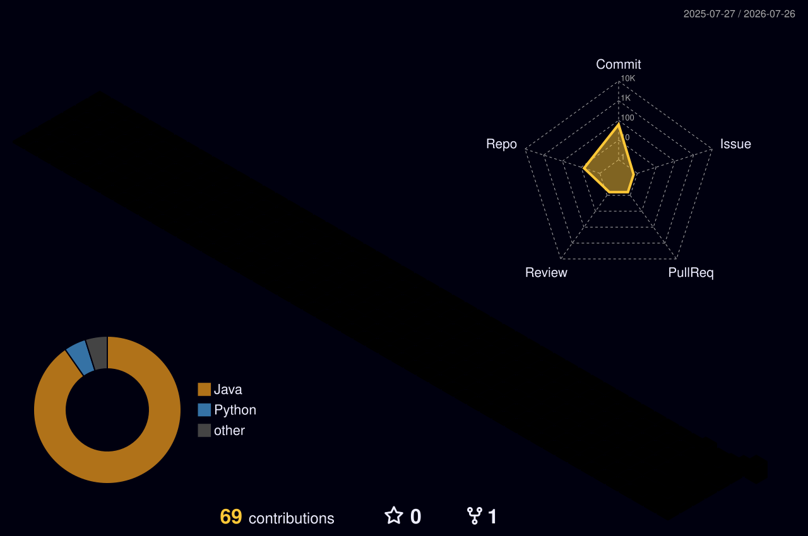

<!-- ============ TITLE BANNER ============ -->

<!-- ============ ANIMATED TYPING SUBTITLE ============ -->

<!-- ============ TOP BADGES ============ -->

<!-- ============ TECH STACK WALL BANNER ============ -->
<!-- FIX: changed blob URL → raw URL so the image loads reliably in all contexts -->

---

## 🧑‍💻 About Me

- 🔭 I'm currently working on **SRE Agent**
- 🌱 I'm currently learning **agentic AI** — RAG, LangChain, LangGraph & MCP
- 💬 Ask me about **Backend and System Design**
- ⚡ Fun fact: my code works on the first try... in my dreams 😴

---

## 🤝 Connect with me

---

## 🛠️ Tech Stack

### 💻 Languages & Frameworks

### 🗄️ Databases & Tools

### ☁️ Cloud & DevOps

### 🤖 Agentic AI

---

## 📊 GitHub Stats

 

---

## 📌 Top Repositories

 

<!-- FIX: repo param was "REdesign-pattern-masterclassPO_4" — corrected to match the actual repo name -->

 

---

## 🧊 3D Contribution Calendar

<!-- Generated daily by .github/workflows/profile-3d.yml → committed back to main -->

---

## 📈 Contribution Activity Graph

---

## 🐍 Watch My Contributions Get Eaten

<!-- Generated by .github/workflows/snake.yml → pushed to the "output" branch -->

---

## 🏆 Trophies

---

## 😂 Random Dev Joke

<!-- NEW: Readme-Jokes — refreshes on every page load -->

---

## 💡 Dev Quote of the Day

---

## 📅 Coding Streak & Metrics

<!-- Commits per day of week (uses the same vercel app as the stats above — very reliable) -->

---

## ⭐ Star History

---

### Thanks for visiting! 💜

